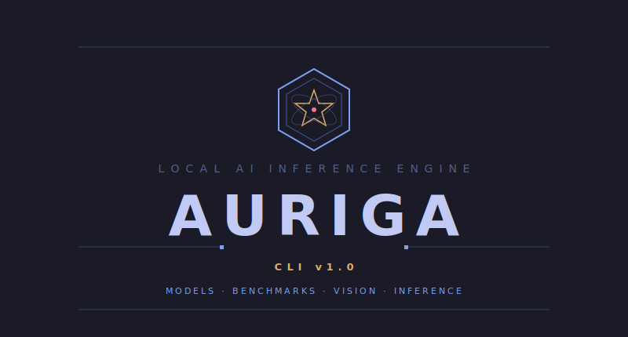

<p align="center">
  
</p>

<p align="center">
  <strong>AI server management CLI for local LLM inference on AMD Strix Halo</strong>
</p>

<p align="center">
  <a href="https://go.dev"></a>
  <a href="LICENSE"></a>
  <a href="https://pi.dev"></a>
</p>

---

## What

`auriga` is a unified CLI for managing LLM models, benchmarks, and development workflows on a local AI server (AMD Ryzen AI Max+ 395, 128GB unified RAM, Fedora 44).

It consolidates model management (Ollama + llama-server), vision-enabled inference (multimodal projectors), meta-benchmarks, and interactive fix sessions with [Pi](https://pi.dev) into a single binary.

## Install

```bash
# Build from source
make build

# Install to ~/bin/
make install

# Cross-compile for Linux (auriga server) and deploy
make deploy
```

## Commands

```
auriga version                                    # Build info
auriga serve start <profile>                      # Start llama-server with a profile
auriga serve start --model X.gguf --mmproj Y.gguf # Start with custom model + vision
auriga serve stop                                 # Stop llama-server, restart Ollama
auriga serve list                                 # List available profiles
auriga model list [--backend ollama|llama-server]  # List installed models + GGUFs
auriga model ensure [--backend ...]               # Download missing models
auriga model create --name X [--gguf|--modelfile]  # Create Ollama model from GGUF/Modelfile
auriga benchmark list [--failed]                   # List meta-benchmark results
auriga fix [--list] [--failed] [--model X]         # Interactive fix workflow with Pi
```

## Configuration

Config file: `~/.config/auriga/config.yaml`

```yaml
ollama:
  host: http://localhost:11434

llama_server:
  host: http://localhost:8090
  port: 8090
  bin: ~/infra/bin/llama-server
  gguf_dir: ~/infra/ai/models/gguf
  mmproj_dir: ~/infra/ai/models/mmproj
  quant: Q4_K_M

profiles:
  qwen3.6-vision:
    model: Qwen3.6-35B-A3B-UD-Q4_K_M.gguf
    mmproj: Qwen3.6-35B-A3B-mmproj-BF16.gguf
    flags: [--jinja]
  qwen3.6-uncensored-vision:
    model: Qwen3.6-35B-A3B-Uncensored-HauhauCS-Aggressive-Q4_K_M.gguf
    mmproj: mmproj-Qwen3.6-35B-A3B-Uncensored-HauhauCS-Aggressive-f16.gguf
    flags: [--jinja]

benchmark:
  results_dir: ~/Projects/auriga-lab/results

pi:
  bin: ~/.npm-global/bin/pi
```

### Environment Variables

Compatible with the Python scripts `.envrc` — same env vars work:

| Variable | Config key | Default |
|----------|-----------|---------|
| `OLLAMA_HOST` | `ollama.host` | `http://localhost:11434` |
| `OLLAMA_MODELS` | `ollama.models` | — |
| `LLAMA_SERVER_HOST` | `llama_server.host` | `http://localhost:8090` |
| `LLAMA_SERVER_BIN` | `llama_server.bin` | `~/infra/bin/llama-server` |
| `LLAMA_SERVER_GGUF_DIR` | `llama_server.gguf_dir` | `~/infra/ai/models/gguf` |
| `LLAMA_SERVER_QUANT` | `llama_server.quant` | `Q4_K_M` |
| `BENCH_RESULTS_DIR` | `benchmark.results_dir` | `~/Projects/auriga-lab/results` |
| `BENCH_MAX_TOKENS` | `benchmark.max_tokens` | `32768` |
| `BENCH_MAX_RETRIES` | `benchmark.max_retries` | `5` |
| `BENCH_GEN_TIMEOUT` | `benchmark.gen_timeout` | `900` |

Precedence: CLI flag > env var > config file > default.

## Vision Support

Auriga supports multimodal inference via llama-server with `--mmproj` projectors:

```bash
# Start with vision profile
auriga serve start qwen3.6-uncensored-vision

# Use with Pi
pi --model local -p @screenshot.png "What's wrong with this UI?"
```

Models with vision support:

| Model | mmproj | Size |
|-------|--------|------|
| Qwen3.6-35B-A3B | `Qwen3.6-35B-A3B-mmproj-BF16.gguf` | 861 MB |
| Qwen3.6 Uncensored (HauhauCS) | `mmproj-...-Aggressive-f16.gguf` | 858 MB |

## Fix Workflow

The `fix` command automates the iterative project repair workflow:

```bash
# List failed benchmark results
auriga fix --failed

# Pick and fix interactively
auriga fix

# Jump to a specific model
auriga fix --model gemma4
```

Flow: select result → start model (Ollama or llama-server) → generate `.pi/SYSTEM.md` → launch Pi → work → cleanup.

## Hardware

Designed for AMD Ryzen AI Max+ 395 with 128GB LPDDR5x unified memory (108GB GTT for GPU). Runs MoE models at 50-90 tok/s and dense models at 15-22 tok/s.

## License

MIT
