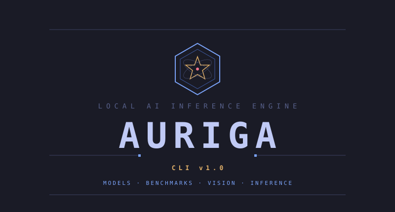

<p align="center">
  
</p>

<p align="center">
  <strong>AI server management CLI for local LLM inference on AMD Strix Halo</strong>
</p>

<p align="center">
  <a href="https://go.dev"></a>
  <a href="LICENSE"></a>
  <a href="https://pi.dev"></a>
</p>

---

## What

`auriga` is a unified CLI for managing LLM models, benchmarks, and development workflows on a local AI server (AMD Ryzen AI Max+ 395, 128GB unified RAM, Fedora 44).

It consolidates model management (Ollama + llama-server), vision-enabled inference (multimodal projectors), meta-benchmarks, and interactive fix sessions with [Pi](https://pi.dev) into a single binary.

## Install

```bash
# Build from source
make build

# Install to ~/bin/
make install

# Cross-compile for Linux (auriga server) and deploy
make deploy
```

## Commands

```
auriga version                                    # Build info
auriga serve start <profile>                      # Start llama-server with a profile
auriga serve start --model X.gguf --mmproj Y.gguf # Start with custom model + vision
auriga serve stop                                 # Stop llama-server, restart Ollama
auriga serve list                                 # List available profiles
auriga model list [--backend ollama|llama-server]  # List installed models + GGUFs
auriga model ensure [--backend ...]               # Download missing models
auriga model create --name X [--gguf|--modelfile]  # Create Ollama model from GGUF/Modelfile
auriga model prune                                # Interactive model cleanup (all backends)
auriga profile list                               # List configured profiles with type/port
auriga profile sync [--name X]                    # Download missing GGUF/mmproj from HuggingFace
auriga profile prune [--dry-run]                  # Delete orphaned model files
auriga profile serve <name> [--daemon]            # Start llama-server with a profile
auriga profile switch <name> [--persistent]       # Switch to a different profile
auriga profile stop [name]                        # Stop running llama-server instance(s)
auriga profile validate                           # Validate configs vs model caps + GTT memory
auriga benchmark list [--failed]                  # List meta-benchmark results
auriga fix [--list] [--failed] [--model X]        # Interactive fix workflow with Pi
```

## Configuration

Config file: `~/.config/auriga/config.yaml`

```yaml
ollama:
  host: http://localhost:11434

llama_server:
  host: http://localhost:8090
  bin: ~/infra/bin/llama-server
  gguf_dir: ~/infra/ai/models/gguf
  mmproj_dir: ~/infra/ai/models/mmproj
  quant: Q4_K_M
  dense_port: 8090
  moe_port: 8091
  ctx_size: 131072          # global default, overridden per-profile

  reasoning_budget: 4096

profiles:
  qwen3.6-27b:
    type: dense
    ctx_size: 65536           # dense: conserve memory for MoE on other port
    repo: unsloth/Qwen3.6-27B-MTP-GGUF
    model: Qwen3.6-27B-Q8_0.gguf
    mmproj: mmproj-BF16.gguf
    flags: [--jinja, --cache-type-k, q8_0, --cache-type-v, q8_0,
            --spec-type, draft-mtp, --spec-draft-n-max, "2"]
  qwen3.6-vision:
    type: moe
    ctx_size: 262144          # Qwen3.6 MoE supports 262K, fits in dual
    repo: unsloth/Qwen3.6-35B-A3B-MTP-GGUF
    model: Qwen3.6-35B-A3B-Q8_0.gguf
    mmproj: mmproj-BF16.gguf
    flags: [--jinja, --cache-type-k, q8_0, --cache-type-v, q8_0,
            --spec-type, draft-mtp, --spec-draft-n-max, "2"]
  gemma4-12b-vision:
    type: dense
    ctx_size: 65536
    repo: unsloth/gemma-4-12b-it-GGUF
    model: gemma-4-12b-it-Q8_0.gguf
    mmproj: mmproj-BF16.gguf
    mtp_drafter: mtp-gemma-4-12b-it.gguf
    flags: [--spec-type, draft-mtp, --spec-draft-n-max, "2"]

benchmark:
  results_dir: ~/Projects/auriga-lab/results

pi:
  bin: ~/.npm-global/bin/pi
```

### Environment Variables

Compatible with the Python scripts `.envrc` — same env vars work:

| Variable | Config key | Default |
|----------|-----------|---------|
| `OLLAMA_HOST` | `ollama.host` | `http://localhost:11434` |
| `OLLAMA_MODELS` | `ollama.models` | — |
| `LLAMA_SERVER_HOST` | `llama_server.host` | `http://localhost:8090` |
| `LLAMA_SERVER_BIN` | `llama_server.bin` | `~/infra/bin/llama-server` |
| `LLAMA_SERVER_GGUF_DIR` | `llama_server.gguf_dir` | `~/infra/ai/models/gguf` |
| `LLAMA_SERVER_QUANT` | `llama_server.quant` | `Q4_K_M` |
| `BENCH_RESULTS_DIR` | `benchmark.results_dir` | `~/Projects/auriga-lab/results` |
| `BENCH_MAX_TOKENS` | `benchmark.max_tokens` | `32768` |
| `BENCH_MAX_RETRIES` | `benchmark.max_retries` | `5` |
| `BENCH_GEN_TIMEOUT` | `benchmark.gen_timeout` | `900` |

Precedence: CLI flag > env var > config file > default.

## Multi-Instance (Dense + MoE)

Auriga supports running a dense and MoE model simultaneously on separate ports. MoE models MUST NOT run on the same port as dense models.

```bash
# Start dense model on port 8090
auriga profile serve qwen3.6-27b --daemon

# Start MoE model on port 8091
auriga profile serve qwen3.6-vision --daemon

# Check both instances
auriga ps

# Stop specific profile
auriga profile stop qwen3.6-27b

# Stop all instances
auriga profile stop
```

Model type is auto-detected from the model name (`-A3B`, `-A4B` patterns indicate MoE) or can be set explicitly with `--type` or the `type:` field in config.

Port resolution: `profile.port` (explicit) > type-derived (`dense_port`/`moe_port`) > `dense_port` > 8090.

## Vision Support

Auriga supports multimodal inference via llama-server with `--mmproj` projectors:

```bash
# Start with vision profile
auriga profile serve qwen3.6-vision

# Use with Pi
pi --model local -p @screenshot.png "What's wrong with this UI?"
```

## Fix Workflow

The `fix` command automates the iterative project repair workflow:

```bash
# List failed benchmark results
auriga fix --failed

# Pick and fix interactively
auriga fix

# Jump to a specific model
auriga fix --model gemma4
```

Flow: select result → start model (Ollama or llama-server) → generate `.pi/SYSTEM.md` → launch Pi → work → cleanup.

## Speculative Decoding (MTP)

Auriga profiles support Multi-Token Prediction for ~2x inference speedup on Strix Halo:

```yaml
# Built-in MTP (model includes draft heads)
flags: [--spec-type, draft-mtp, --spec-draft-n-max, "2"]

# External MTP drafter (separate GGUF)
mtp_drafter: mtp-gemma-4-12b-it.gguf
mtp_drafter_repo: unsloth/gemma-4-12b-it-GGUF  # for sync
flags: [--spec-type, draft-mtp, --spec-draft-n-max, "2"]

# DFlash drafter (Muse Glimmer)
dflash: dflash-kquant.gguf
```

MTP + vision (mmproj) works on llama-server b9601+: text turns get MTP acceleration, vision turns auto-fallback.

## Profile Cleanup

```bash
# Preview orphaned files (not referenced by any profile)
auriga profile prune --dry-run

# Delete orphaned files
auriga profile prune
```

Scans `gguf_dir` and `mmproj_dir` for `.gguf` files not referenced by any profile's `model`, `mmproj`, `mtp_drafter`, or `dflash` fields.

## Hardware

Designed for AMD Ryzen AI Max+ 395 with 128GB LPDDR5x unified memory (108GB GTT for GPU). With MTP enabled: dense Q8 models at ~30-44 tok/s, MoE models at ~50-90 tok/s.

## License

MIT
